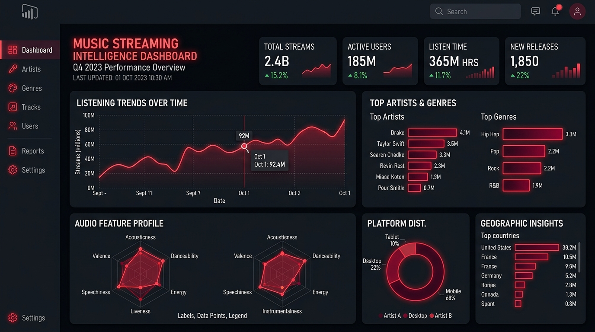

# Anurag Pal - Creative Data Analyst & Power BI Portfolio | https://anurag-pal.vercel.app/

A high-performance, scroll-driven interactive portfolio website for **Anurag Pal**, featuring 240-frame canvas scrubbing, live project showcases, GitHub repositories, and interactive certifications.



## 🚀 Live Demo & Local Preview
- Clone this repository:
  ```bash
  git clone https://github.com/trulyanu/Anurag-Pal.git
  cd Anurag-Pal
  ```
- Run the built-in local server (PowerShell):
  ```powershell
  .\server.ps1
  ```
- Or simply open `index.html` in any modern web browser.

## 🛠️ Tech Stack & Architecture
- **Frontend**: Vanilla HTML5, Modern CSS3, Vanilla JavaScript (ES6+)
- **Animation Engine**: High-DPI HTML5 `<canvas>` with LERP physics for silky-smooth scroll-driven video frame scrubbing (240 frames @ 24fps)
- **Design System**: Editorial Noir aesthetic with crimson red neon accents, glassmorphic cards (`backdrop-filter: blur`), and responsive layouts (mobile, tablet, desktop)
- **Local Server**: Lightweight .NET `HttpListener` PowerShell server with MIME types and CORS support

## 📊 Featured Solutions & Projects
- [**Spotify Streaming Analytics & Track Intelligence**](https://github.com/trulyanu) — Power BI, DAX Measures, Multi-Table Star Schema
- [**HR Attrition & Employee Turnover Analysis**](https://github.com/trulyanu/HE-Attrition-Analysis-using-Power-BI) — Power BI, Workforce KPIs, Attrition Heatmaps
- [**Customer Shopping Behavior & Segmentation**](https://github.com/trulyanu/Customer-Shopping-Behavior-Analysis) — Python, Pandas, Cohort Heatmaps, CLV Modeling
- [**Call Centre Operations & Performance Dashboard**](https://github.com/trulyanu/Call-Centre-Analysis-Dashboard) — Power BI, AHT, FCR, CSAT Gauges, Agent Rankings
- [**Automated Retail & Inventory Data Pipeline**](https://github.com/trulyanu) — Python, Pandas, NumPy, Power BI
- [**Enterprise Transactional Data Audit & Query Optimization Engine**](https://github.com/trulyanu) — PostgreSQL, MySQL, SQL Server, Stored Procedures

## 🎓 Certifications
- **Oracle Certified: Agentic AI Foundations Associate** (Oracle Cloud Infrastructure)
- **Microsoft Certified: Power BI Data Analyst Associate (PL-300)**
- **Microsoft Certified: Fabric Analytics Engineer Associate (DP-600)** [In Progress]
- **Google Data Analytics Professional Certificate**
- **IBM Generative AI: Engineering & Fundamentals**
- **Coursera: Advanced Data Structures & Database Management**

## 📬 Contact & Connect
- **Email**: [anuragpal00018@gmail.com](mailto:anuragpal00018@gmail.com)
- **LinkedIn**: [linkedin.com/in/anuragpal0699](https://linkedin.com/in/anuragpal0699)
- **GitHub**: [github.com/trulyanu](https://github.com/trulyanu)
- **Location**: Bangalore, India
